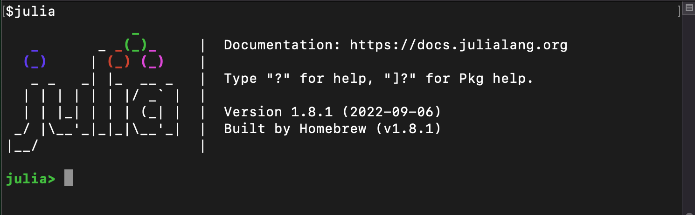
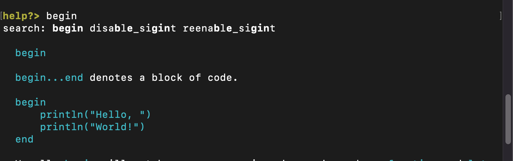

# 入门指南

不管是使用预编译的可执行文件还是自己编译，**Julia**的安装都是相当方便的。参照[https://julialang.org/downloads/](https://julialang.org/downloads/)的教程下载安装**Julia**。

如果你是从下面的某个语言来到**Julia**的话，你应该阅读一下那些相对**MATLAB**, **R**, **Python**，**C/C++**或者**Common Lisp**语言差别的章节。这可以避免你陷入一些由于语言上微小不同处理方式造成的陷阱。

最简单的学习和实验**Julia**语言的方式，就是通过双击**Julia**可执行程序或者在命令行里面运行*Julia*来开启一个交互式的窗口（也被称为REPL(读-计算-输出-循环)。



退出这个交互环境，可以按*CTRL-D*，或者输入`exit()`。刚进入**Julia**环境的时候，*Julia*会显示一个横幅，并提示用户输入。一旦用户输入了一个完整的表达式，然后按下回车，就会计算这个表达式，并把结果显示出来。如果表达式末尾跟上一个分号“;”，那么结果就不会被显示。变量`ans`被用来绑定到上一次计算的结果，不管它有没有被显示过。`ans`变量只在交互式环境里面有效，其他方式运行**Julia**代码是无效的。

如果想运行已经写好的*file.jl*源文件，只要运行`include("file.jl")`就可以了。

如果希望不进入交互式环境，直接运行*Julia*代码，只要将文件名作为`julia`命令的第一个参数就可以了：

```
$ julia script.jl
```

你可以传递额外的参数到*Julia*或是到你的程序*script.jl*。具体的参数信息参考[Command-line Options](https://docs.julialang.org/en/v1/manual/command-line-options/#command-line-options)。

# 资源

在**Julia**的官方主页上有一些有用的学习材料，可以帮助新手快速上手*Julia*语言.

你也可以在**REPL**开启帮助模式来作为学习资源。在`julia>`提示符，输入`?`，可以开启帮助模式。输入关键字，就能帮你查找对应的文档。也可以查询你遇到的函数或者对象信息。



如果你对**Julia**本来就有一定了解，你可以参看**性能提示**和**工作流提示**。
