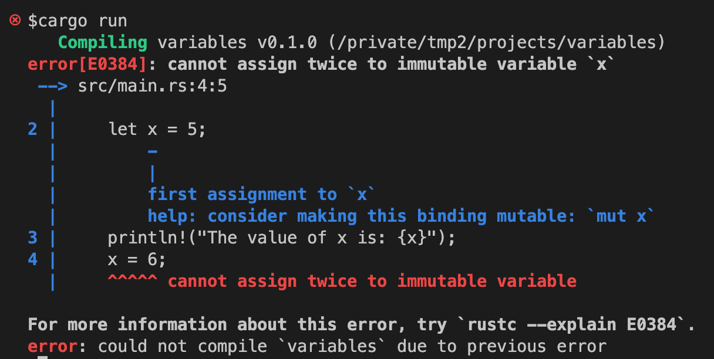

原文：[https://doc.rust-lang.org/book/ch03-01-variables-and-mutability.html](https://doc.rust-lang.org/book/ch03-01-variables-and-mutability.html)

# 变量和可变性

就好像在"Storing Values with Variables"（将值存入变量）这一部分提到的，默认`Rust`变量是不可变的(immutable)。这也是`Rust`让你编写更加安全和更容易并发代码的一种方式。当然，你还是可以让你的变量可以变化的。让我们来看看`Rust`是如何以及为什么鼓励你使用不可变的变量，以及在什么时候我们需要使用正常可变的变量。

所谓变量不可变(immutable)，就是一旦一个值和一个变量名绑定，你就不能更改这个值了。为了说明这个，让我们创建一个名叫*variables*的项目，可以使用`cargo new variables`命令。

然后进入新创建的*variables*目录，打开`src/main.rs`文件，将文件内容替换为下面的代码。这代码是不能正常编译的，主要是来解释默认变量是不可变的。

文件名: *src/main.rs*

```
fn main() {
    let x = 5;
    println!("The value of x is: {x}");
    x = 6;
    println!("The value of x is: {x}");
}
```

保存，然后运行程序。使用`cargo run`命令。你就可以看到一下出错信息了：



这个例子展示了编译器如何帮助你发现程序的问题。这种编译错误通常都是挺烦人的，不过这并不说明你不是一个好的程序员，而只是说明你的程序还没有足够安全的来完成你想实现的目标。就算是非常有经验的`Rust`程序员同样会经常收到编译错误。

出错信息也告诉你了，`cannot assign twice to immutable variable`，不能对不可变的变量`x`进行两次赋值。

在编译期，能够将修改不可变变量这种操作报出来，相当重要。因为这非常容易造成bug。如果你的一段代码基于某个值是不能变的，而另一段代码却去修改这个值，那很可能造成之前那段代码不能正常运行。这种类型的bug非常难查，特别是这个值只是有时候会被改变。Rust编译器可以保证，你既然申明了这个值不可变，它就不会变，编译器会帮你去跟踪这个值。你的代码也更容易去推断。

但是可变性还是相当有用的，也可以让你的代码更容易去写。尽管变量默认是不可变的，但是你可以通过在变量名前加上`mut`用来声明变量是可变的。在第二章里面我们已经这么做过了。加上`mut`之后，也是告诉之后读代码的人，这个变量是可以修改的。

接着，让我们把`mut`加到刚才的*main.rs*里面去。

文件名: *src/main.rs*

```
fn main() {
    let mut x = 5;
    println!("The value of x is: {x}");
    x = 6;
    println!("The value of x is: {x}");
}
```

在运行代码，就能输出我们希望的结果了。


加上`mut`之后，`x`的值就能改成`6`了。当然，变量是否可变在于你自己的设计，只有写程序的人才最清楚在那个特定场合，变量是否可变。

# 常量


