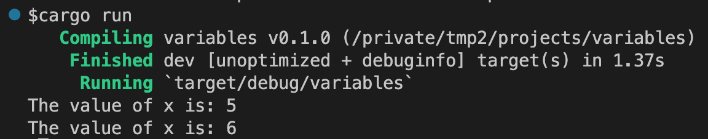

原文：[https://doc.rust-lang.org/book/ch03-01-variables-and-mutability.html](https://doc.rust-lang.org/book/ch03-01-variables-and-mutability.html)

# 变量和可变性

在"Storing Values with Variables"（将值存入变量）这部分就提到过，默认**Rust**变量是不可变的(*imutable*)。这也是**Rust**让你编写更安全和更容易并发代码的一种方式。当然，你还是可以让你的变量可变。让我们先来看看`Rust`是如何以及为什么鼓励你使用不可变变量，以及在什么时候我们需要使用正常可变的变量。

所谓变量不可变(*immutable*)，就是一旦值和变量名绑定，你就不能更改这个值了。为了说明这个，让我们创建一个名叫*variables*的项目，使用`cargo new variables`命令。

进入新创建的*variables*目录，打开`src/main.rs`，将文件内容替换为下面的代码。这代码还不能正常编译，主要是用来解释默认变量是不可变的。

文件名: *src/main.rs*

```
fn main() {
    let x = 5;
    println!("The value of x is: {x}");
    x = 6;
    println!("The value of x is: {x}");
}
```

保存，运行程序。使用`cargo run`。你可以看到以下出错信息：


这个例子展示了编译器如何帮助你发现程序问题的。编译错误通常都是挺烦人的，不过这并不说明你不是一个好的程序员，只是说明你的程序还没有足够安全的来完成你想要实现的目标。就算是非常有经验的**Rust**程序员，同样会经常收到编译错误。

出错信息也告诉你了，`cannot assign twice to immutable variable`，不能对不可变变量`x`进行两次赋值。

编译期就能够将修改不可变变量这种操作报出来，相当重要。因为这非常容易造成bug。如果你的一段代码是基于某个值不能变的，而另一段代码却去修改这个值，那很可能造成之前那段代码不能正常运行。这种类型的bug非常难查，特别是这个值只是在某些特定时候被改变。**Rust**编译器可以保证，你既然申明了这个值不可变，它就不会变，编译器会帮你去跟踪这个值。你的代码也更容易去推断。

但是可变性还是相当有用的，也可以让你的代码更容易去写。尽管变量默认是不可变的，但是你可以通过在变量名前加上`mut`用来声明变量是可变的。在第二章里面我们已经这么做过了。加上`mut`之后，也是告诉之后读代码的人，这个变量是可以修改的。

接着，让我们把`mut`加到刚才的*main.rs*里面去。

文件名: *src/main.rs*

```
fn main() {
    let mut x = 5;
    println!("The value of x is: {x}");
    x = 6;
    println!("The value of x is: {x}");
}
```

再运行代码，就能输出我们希望的结果了。



加上`mut`之后，`x`的值就能改成`6`了。当然，变量是否可变在于你自己的设计，只有写程序的人才最清楚在哪个特定场合，变量是否可变。

# 常量

与不可变变量很像，常量也是在绑定到一个名字之后，它的值是不能变的。不过常量和不可变变量还是有点区别的。

首先你不能给常量添加`mut`。常量不单单是默认不可变，而是永远不可变。常量使用`const`，而变量使用`let`关键字，而且常量必须指定类型。我们会在下一章”Data Types"(数据类型）讨论类型。这里你只要记住常量必须指定类型。

第二点，常量可以定义在任何地方，包括全局定义，比较适合需要被许多代码引用的值。

最后，常量只能通过常量表达式进行赋值，不能在运行时计算出来。

例子：

```
const THREE_HOURS_IN_SECONDS: u32 = 60 * 60 * 3;
```

常量名是`THREE_HOURS_IN_SECONDS`，值是`60*60*3`的运算结果。**Rust**通常使用全部大写，单词之间用下划线(`_`)分隔来命名常量。编译器可以在编译期计算这个常量值，所以我们可以使用可读性更高的`60*60*3`，而不是`10800`。参考*Rust Reference's section on constant evaluation*(Rust语言参考的常量计算部分)来了解哪些操作可以在常量定义的时候使用。

常量在程序运行的整个生命周期里面都有效。对于那些在程序的多个部分都需要使用的值比较有用。比如游戏里面每个成员能够获得的点数最大值，或者光速值。

将那些硬编码的值用常量代替，让之后的代码维护人员更容易了解值的含义，并且当需要修改的时候，动一个地方就行。

# 遮挡（Shadowing)

在第二章的猜谜游戏里面，可以看到，用之前声明过的变量名，重新声明一个新的变量。**Rust**程序员把这个称谓第二个变量把第一个变量遮挡了(Shadowed)。也就是说当你使用这个变量名的时候，编译器看到的是第二个变量，直到它被后面的变量所遮挡，或者跳出了它的定义范围。

文件名：*src/main.rs*

```
fn main() {
    let x = 5;
    let x = x + 1;
    { 
        let x = x * 2;
        println!("The value of x in the inner scope is: {x}");
    }
    println!("The value of x is: {x}");
}
```

这段代码首先把`x`设为`5`， 然后加`1`，赋给新的`x`变量，然后在内部代码块，让`x`乘`2`，赋给又一个新的`x`变量。代码块内部，我们得到`12`，走出代码块，就回到了第二个`x`变量，所以输出结果会是`6`。

运行结果如下：


遮挡(Shadowing)和使用`mut`不一样，比如我们对变量不加上`let`赋值，编译器就会直接报错。`let`可以新生成一个不可变的变量，所以可以用于一些变量的转换操作，新得到的变量还是不可变的（*immutable*)。

由于会新生成变量，新变量甚至可以和原来的变量是不同的数据类型。比方说下面的代码需要得到空格的数量。

```
    let spaces = "   ";
    let spaces = spaces.len();
```

第一个`spaces`变量是字符串，而第二个`spaces`变量则是数字。这样就省去了有些语言里面必须要使用两个变量名，比如`spaces_str`和`spaces_num`。这里我们不能使用`mut`，因为`mut`不能改变数据类型，比如下面的代码：

```
    let mut spaces = "   ";
    spaces = spaces.len();
```

可以看到编译错误：


好了，看过变量怎么工作的，让我们来了解更多的数据类型。
